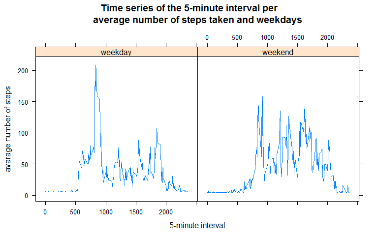

Loading and preprocessing the data
----------------------------------

-   **1. Load the data (i.e. read.csv())**

<!-- -->

    library(lubridate)
    library(timeDate)
    activity = read.csv("activity.csv", header = T, sep = ",")

-   **2. Process/transform the data (if necessary) into a format
    suitable for your analysis**

<!-- -->

    Sys.setlocale(category = "LC_ALL", locale = "C") # Put in English

    ## [1] "C"

    activity$days = as.POSIXlt(activity$date,"%Y-%m-%d %H:%M:%S")

What is mean total number of steps taken per day?
-------------------------------------------------

-   **1. Calculate the total number of steps taken per day**

<!-- -->

    nsteps = aggregate(steps ~ date, activity, sum)

-   **2. If you do not understand the difference between a histogram and
    a barplot, research the difference between them. Make a histogram of
    the total number of steps taken each day**

<!-- -->

    hist(nsteps$steps, col = "grey", xlab = "Total steps per day", ylab = "Frequency", main = "Distribution of the number of steps per day")

-   **3. Calculate and report the mean and median of the total number of
    steps taken per day**

<!-- -->

    meanstepsperday = mean(nsteps$steps); meanstepsperday

    ## [1] 10766.19

    medianstepsperday = median(nsteps$steps); medianstepsperday 

    ## [1] 10765

The mean of the total number of steps taken per day is 10766 and the
median of the total number of steps taken per day is 10765.

What is the average daily activity pattern?
-------------------------------------------

-   **1. Make a time series plot (i.e. type = "l") of the 5-minute
    interval (x-axis) and the average number of steps taken, averaged
    across all days (y-axis).**

<!-- -->

    avar_pattern_day = aggregate(steps ~ interval, activity, mean)
    plot(avar_pattern_day$interval, avar_pattern_day$steps , type = "l", col = "blue", xlab = "5-minute interval", ylab = "average number of steps taken", 
         main = "Time series of the 5-minute interval per 
         average number of steps taken")

-   **2. Which 5-minute interval, on average across all the days in the
    dataset, contains the maximum number of steps?**

<!-- -->

    maxsteps =  avar_pattern_day[which.max(avar_pattern_day$steps), ]
    maxsteps

    ##     interval    steps
    ## 104      835 206.1698

The maximum steps 206.17 is on 835 interval.

Imputing missing values
-----------------------

Note that there are a number of days/intervals where there are missing
values (coded as NA). The presence of missing days may introduce bias
into some calculations or summaries of the data.

-   **1. Calculate and report the total number of missing values in the
    dataset (i.e. the total number of rows with NAs)**

<!-- -->

    anyNA(activity$steps)

    ## [1] TRUE

    anyNA(activity$date)

    ## [1] FALSE

    anyNA(activity$interval)

    ## [1] FALSE

    table(is.na(activity$steps)) # because steps is only with missing values

    ## 
    ## FALSE  TRUE 
    ## 15264  2304

There are 2304 rows with missings values.

-   **2. Devise a strategy for filling in all of the missing values in
    the dataset. The strategy does not need to be sophisticated. For
    example, you could use the mean/median for that day, or the mean for
    that 5-minute interval, etc.**

I´ll use the mean of steps.

-   **3. Create a new dataset that is equal to the original dataset but
    with the missing data filled in.**

<!-- -->

    library(Hmisc)
    newData = activity
    newData$steps = impute(activity$steps, fun = mean)

-   **4. Make a histogram of the total number of steps taken each day
    and Calculate and report the mean and median total number of steps
    taken per day. Do these values differ from the estimates from the
    first part of the assignment? What is the impact of imputing missing
    data on the estimates of the total daily number of steps?**

<!-- -->

    newnsteps = aggregate(steps ~ date, newData, sum)
    hist(newnsteps$steps, col = "grey", xlab = "Total steps per day", ylab = "Frequency", main = "Distribution of the number of steps per day 
         (no missing values)")

Below, after imputation we've the same mean for the total steps taken
per day. The new median of total steps taken per day is greater than
that of old median.

    meannewstepsperday = mean(newnsteps$steps); meannewstepsperday

    ## [1] 10766.19

    mediannewstepsperday = median(newnsteps$steps); mediannewstepsperday 

    ## [1] 10766.19

Are there differences in activity patterns between weekdays and weekends?
-------------------------------------------------------------------------

-   **1. Create a new factor variable in the dataset with two levels -
    "weekday" and "weekend" indicating whether a given date is a weekday
    or weekend day.**

<!-- -->

    newData$week_days = weekdays.POSIXt(newData$days)
    newData$weekdays = as.factor(ifelse(newData$week_days %in% c("Saturday","Sunday"), 'weekend', 'weekday'))

-   **2. Make a panel plot containing a time series plot (i.e. type
    = "l") of the 5-minute interval (x-axis) and the average number of
    steps taken, averaged across all weekday days or weekend
    days (y-axis). See the README file in the GitHub repository to see
    an example of what this plot should look like using
    simulated data.**

<!-- -->

    avgbydays = aggregate(steps ~ interval + weekdays, data = newData, mean)
    library(lattice)
    xyplot(avgbydays$steps ~ avgbydays$interval | avgbydays$weekdays, type = "l", xlab = "5-minute interval", ylab = "avarage number of steps", layout = c(2, 1), main = "Time series of the 5-minute interval per
           average number of steps taken and weekdays")

We can see some differences in activity patterns between weekdays and
weekends.
